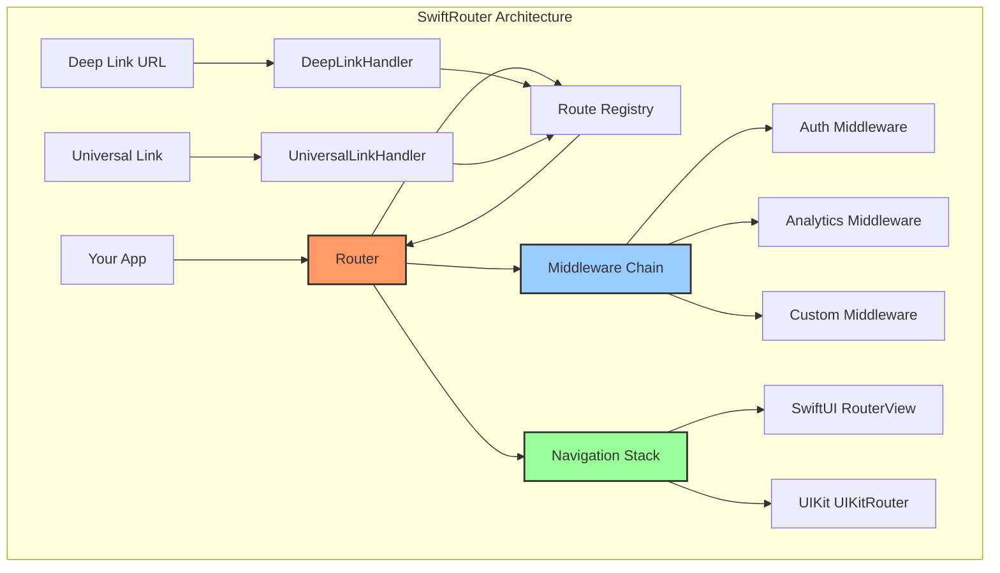

```
   _____ _    _ _____ ______ _______ _____   ____  _    _ _______ ______ _____  
  / ____| |  | |_   _|  ____|__   __|  __ \ / __ \| |  | |__   __|  ____|  __ \ 
 | (___ | |  | | | | | |__     | |  | |__) | |  | | |  | |  | |  | |__  | |__) |
  \___ \| |  | | | | |  __|    | |  |  _  /| |  | | |  | |  | |  |  __| |  _  / 
  ____) | |__| |_| |_| |       | |  | | \ \| |__| | |__| |  | |  | |____| | \ \ 
 |_____/ \____/|_____|_|       |_|  |_|  \_\\____/ \____/   |_|  |______|_|  \_\
```

<p align="center">
  <strong>🧭 The most powerful, type-safe navigation router for iOS</strong>
</p>

<p align="center">
  <a href="https://github.com/muhittincamdali/SwiftRouter/actions/workflows/ci.yml">
    
  </a>
  <a href="https://codecov.io/gh/muhittincamdali/SwiftRouter">
    
  </a>
  
  
  
  <a href="https://github.com/muhittincamdali/SwiftRouter/blob/main/LICENSE">
    
  </a>
  <a href="https://swift.org/package-manager/">
    
  </a>
</p>

<p align="center">
  <a href="#-features">Features</a> •
  <a href="#-installation">Installation</a> •
  <a href="#-quick-start">Quick Start</a> •
  <a href="#-architecture">Architecture</a> •
  <a href="#-advanced-usage">Advanced</a> •
  <a href="#-migration">Migration</a> •
  <a href="#-documentation">Documentation</a>
</p>

---

## Why SwiftRouter?

Navigation in iOS apps is often **scattered, hard to test, and tightly coupled** to views. Deep linking requires manual URL parsing. State restoration is complex. **SwiftRouter** solves all of this.

```swift
// ❌ Before: Scattered, untestable navigation
NavigationLink(destination: ProfileView(userId: userId)) { ... }
// Deep link parsing in AppDelegate
// State restoration in SceneDelegate
// No middleware, no analytics, no auth checks

// ✅ After: Unified, type-safe, testable routing
router.push(ProfileRoute(userId: userId))
// Deep links work automatically
// State persists automatically
// Middleware handles auth, analytics, logging
```

## 🌟 Features

| Feature | Description |
|---------|-------------|
| 🎯 **Type-Safe Routes** | Compile-time validation with Swift's type system |
| 🔗 **Deep Linking** | URL schemes and Universal Links out of the box |
| 💾 **State Persistence** | Automatic navigation state save/restore |
| ⚡ **Async/Await** | Modern Swift concurrency throughout |
| 🧪 **100% Testable** | Mock router for unit testing |
| 🛡️ **Auth Middleware** | Built-in authentication guards |
| 📊 **Analytics Middleware** | Track every navigation event |
| 📱 **SwiftUI Native** | First-class SwiftUI support |
| 🎨 **UIKit Support** | Full UINavigationController integration |
| 🗂️ **Tab Navigation** | Multi-tab with independent stacks |
| 📐 **Split View** | iPad split view support |
| 🎭 **Coordinator Pattern** | Built-in coordinator support |

## 📦 Installation

### Swift Package Manager

```swift
dependencies: [
    .package(url: "https://github.com/muhittincamdali/SwiftRouter.git", from: "1.0.0")
]
```

### CocoaPods

```ruby
pod 'SwiftRouter', '~> 1.0'
```

## 🚀 Quick Start

### 1. Define Your Routes

```swift
import SwiftRouter

struct HomeRoute: Route {
    static let pattern = "/home"
    var parameters: RouteParameters { [:] }
    
    init(parameters: RouteParameters) throws {}
}

struct ProfileRoute: Route {
    static let pattern = "/profile/:userId"
    let userId: String
    
    var parameters: RouteParameters {
        ["userId": .string(userId)]
    }
    
    init(parameters: RouteParameters) throws {
        guard let userId = parameters.string(for: "userId") else {
            throw RouteError.missingParameter("userId")
        }
        self.userId = userId
    }
}

struct SettingsRoute: Route {
    static let pattern = "/settings/:section?"
    let section: String?
    
    var parameters: RouteParameters {
        var params: [String: RouteParameterValue] = [:]
        if let section { params["section"] = .string(section) }
        return RouteParameters(params)
    }
    
    init(parameters: RouteParameters) throws {
        self.section = parameters.string(for: "section")
    }
}
```

### 2. Setup Router

```swift
@main
struct MyApp: App {
    @StateObject private var router = Router(
        configuration: RouterConfiguration(
            deepLinkScheme: "myapp",
            universalLinkHosts: ["example.com"]
        )
    )
    
    var body: some Scene {
        WindowGroup {
            RouterView(router: router) { route in
                switch route {
                case let route as HomeRoute:
                    HomeView()
                case let route as ProfileRoute:
                    ProfileView(userId: route.userId)
                case let route as SettingsRoute:
                    SettingsView(section: route.section)
                default:
                    NotFoundView()
                }
            }
            .onOpenURL { url in
                Task {
                    try? await router.handleDeepLink(url)
                }
            }
        }
    }
}
```

### 3. Navigate

```swift
struct HomeView: View {
    @Environment(\.router) private var router
    
    var body: some View {
        VStack(spacing: 20) {
            RouterLink(to: ProfileRoute(userId: "123")) {
                Label("View Profile", systemImage: "person")
            }
            
            Button("Open Settings") {
                Task {
                    try? await router?.navigate(
                        to: SettingsRoute(section: "privacy"),
                        action: .present(style: .sheet)
                    )
                }
            }
        }
    }
}
```

## 🏗️ Architecture



### Core Components

| Component | Responsibility |
|-----------|---------------|
| **Router** | Central navigation coordinator |
| **Route** | Type-safe destination definition |
| **RouteRegistry** | Pattern matching and route resolution |
| **NavigationStack** | Push/pop/present/dismiss management |
| **DeepLinkHandler** | URL scheme resolution |
| **UniversalLinkHandler** | AASA-based link handling |
| **Middleware** | Cross-cutting navigation concerns |
| **Coordinator** | Flow management (optional) |

## 🔥 Advanced Usage

### Middleware

```swift
// Authentication Middleware
let authMiddleware = AuthMiddleware(
    provider: myAuthProvider,
    configuration: .init(
        loginRoute: "/login",
        publicPatterns: ["/login", "/register", "/forgot-password"]
    )
)

// Analytics Middleware
let analyticsMiddleware = AnalyticsMiddleware(
    tracker: FirebaseAnalyticsTracker(),
    configuration: .init(
        trackScreenViews: true,
        trackTiming: true
    )
)

// Add to router
router.use(authMiddleware)
router.use(analyticsMiddleware)
```

### Custom Middleware

```swift
struct RateLimitMiddleware: NavigationMiddleware {
    let name = "RateLimit"
    let priority = 50
    
    private let maxNavigationsPerSecond: Int
    private var navigationTimes: [Date] = []
    
    func handle(context: NavigationContext) async throws {
        let now = Date()
        navigationTimes = navigationTimes.filter { now.timeIntervalSince($0) < 1.0 }
        
        guard navigationTimes.count < maxNavigationsPerSecond else {
            throw RouterError.custom("Rate limit exceeded")
        }
        
        navigationTimes.append(now)
    }
}
```

### Coordinator Pattern

```swift
@MainActor
final class OnboardingCoordinator: Coordinator {
    let id = UUID()
    let router: Router
    var childCoordinators: [any Coordinator] = []
    weak var parentCoordinator: (any Coordinator)?
    
    init(router: Router) {
        self.router = router
    }
    
    func start() async {
        try? await router.navigate(to: WelcomeRoute())
    }
    
    func showTerms() async {
        try? await router.navigate(to: TermsRoute())
    }
    
    func completeOnboarding() async {
        await finish()
        // Notify parent to show main app
    }
}
```

### Tab Navigation

```swift
let tabRouter = TabRouter(
    tabs: [
        TabItem(id: "home", title: "Home", systemImage: "house", routeIdentifier: "/home", order: 0),
        TabItem(id: "search", title: "Search", systemImage: "magnifyingglass", routeIdentifier: "/search", order: 1),
        TabItem(id: "profile", title: "Profile", systemImage: "person", routeIdentifier: "/profile", order: 2)
    ],
    configuration: .init(
        doubleTapResetsNavigation: true,
        trackHistory: true
    )
)

// Navigate
try tabRouter.selectTab("search")

// Update badge
tabRouter.updateBadge(.count(5), for: "home")
```

### Split View (iPad)

```swift
let splitRouter = SplitViewRouter(
    configuration: .init(
        layout: .tripleColumn,
        autoSelectFirstSidebarItem: true
    )
)

splitRouter.registerSidebarItems(["inbox", "sent", "drafts"])
splitRouter.registerContentItems(["msg1", "msg2"], for: "inbox")

splitRouter.selectSidebarItem("inbox")
splitRouter.navigateToDetail("/message/123")
```

### Deep Linking

```swift
// URL Scheme: myapp://profile/123
// Universal Link: https://example.com/profile/123

// Both automatically resolve to ProfileRoute(userId: "123")

// Custom URL building
let url = router.deepLinkHandler.buildURL(
    for: ProfileRoute(userId: "456"),
    queryItems: [URLQueryItem(name: "ref", value: "share")]
)
// myapp://profile/456?ref=share
```

### State Persistence

```swift
let router = Router(
    configuration: RouterConfiguration(
        // State automatically saved to UserDefaults
    )
)

// Manual save/restore
router.navigationStack.save(to: userDefaults, key: "nav_state")
router.navigationStack.restore(from: userDefaults, key: "nav_state")
```

## 🔄 Migration

### From Coordinator-based Navigation

```swift
// Before
class ProfileCoordinator {
    func showProfile(userId: String) {
        let vc = ProfileViewController(userId: userId)
        navigationController.pushViewController(vc, animated: true)
    }
}

// After
try await router.navigate(to: ProfileRoute(userId: userId))
```

### From NavigationLink

```swift
// Before
NavigationLink(destination: ProfileView(userId: id)) {
    Text("Profile")
}

// After
RouterLink(to: ProfileRoute(userId: id)) {
    Text("Profile")
}
```

### From Manual Deep Link Handling

```swift
// Before
func application(_ app: UIApplication, open url: URL) -> Bool {
    guard let components = URLComponents(url: url, resolvingAgainstBaseURL: true) else {
        return false
    }
    // 50+ lines of manual parsing...
}

// After
func application(_ app: UIApplication, open url: URL) -> Bool {
    Task { try? await router.handleDeepLink(url) }
    return true
}
```

## 🆚 Comparison

| Feature | SwiftRouter | URLNavigator | Coordinator | Raw NavigationStack |
|---------|-------------|--------------|-------------|---------------------|
| Type-Safe Routes | ✅ | ❌ | ⚠️ | ⚠️ |
| Deep Linking | ✅ | ✅ | ❌ | ❌ |
| Universal Links | ✅ | ❌ | ❌ | ❌ |
| Middleware | ✅ | ❌ | ❌ | ❌ |
| State Persistence | ✅ | ❌ | ❌ | ❌ |
| Async/Await | ✅ | ❌ | ⚠️ | ❌ |
| SwiftUI Native | ✅ | ⚠️ | ⚠️ | ✅ |
| UIKit Support | ✅ | ✅ | ✅ | ❌ |
| Tab Navigation | ✅ | ❌ | ⚠️ | ❌ |
| Split View | ✅ | ❌ | ❌ | ✅ |
| Testable | ✅ | ⚠️ | ✅ | ❌ |

## 🧪 Testing

```swift
class NavigationTests: XCTestCase {
    var router: Router!
    
    override func setUp() {
        router = Router()
        router.register(ProfileRoute.self)
        router.register(SettingsRoute.self)
    }
    
    func testPushNavigation() async throws {
        try await router.navigate(to: ProfileRoute(userId: "123"))
        
        XCTAssertEqual(router.navigationStack.depth, 1)
        XCTAssertTrue(router.navigationStack.topRoute is ProfileRoute)
    }
    
    func testDeepLink() async throws {
        let url = URL(string: "myapp://profile/456")!
        try await router.handleDeepLink(url)
        
        let route = router.navigationStack.topRoute as? ProfileRoute
        XCTAssertEqual(route?.userId, "456")
    }
    
    func testMiddleware() async throws {
        var middlewareCalled = false
        
        router.use(ClosureMiddleware(name: "Test") { _ in
            middlewareCalled = true
        })
        
        try await router.navigate(to: ProfileRoute(userId: "123"))
        
        XCTAssertTrue(middlewareCalled)
    }
}
```

## 📚 Documentation

Full DocC documentation available:

```bash
# Generate documentation
swift package generate-documentation

# Preview documentation
swift package --disable-sandbox preview-documentation
```

### Guides
- [Getting Started](Documentation/GettingStarted.md)
- [Route Definition](Documentation/Routes.md)
- [Deep Linking](Documentation/DeepLinking.md)
- [Middleware](Documentation/Middleware.md)
- [Coordinator Pattern](Documentation/Coordinators.md)
- [Testing](Documentation/Testing.md)

## 🤝 Contributing

Contributions are welcome! Please read our [Contributing Guide](CONTRIBUTING.md) and [Code of Conduct](CODE_OF_CONDUCT.md).

## 📄 License

SwiftRouter is available under the MIT license. See the [LICENSE](LICENSE) file for more info.

---

<p align="center">
  <sub>Built with ❤️ for the iOS community</sub>
</p>

<p align="center">
  <a href="https://github.com/muhittincamdali/SwiftRouter/stargazers">⭐ Star us on GitHub</a>
</p>
